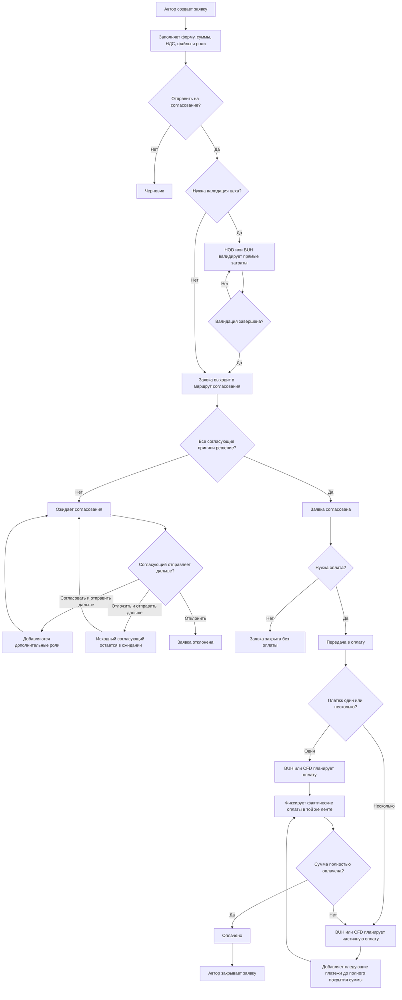

# Aurum: бизнес-процесс заявки

Дата актуализации: 24.04.2026

Ниже схема основного процесса заявки в Aurum. Она покрывает создание, валидацию, согласование, оплату и закрытие.

## Ключевые развилки

- Для конкурсных заявок сначала может потребоваться валидация прямых затрат.
- Любой согласующий может добавить одно или несколько дополнительных согласований.
- Согласование можно не только завершить, но и отложить, отправив заявку коллегам.
- Оплата может быть полной или разбита на несколько частей.
- Для квотных заявок расход ложится на тег и квоту; для заявок из отгрузок проекта — нет.
